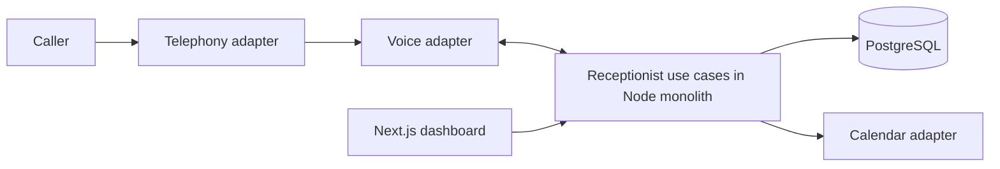

# Pam.ai architecture

## Repository

One npm package and one Next.js App Router application. Keep use cases in feature modules; route handlers and server actions authenticate, validate, call a use case, and map its result to HTTP. Server components call the same use cases for reads.

```text
src/
  app/                       # Pages, layouts, thin HTTP adapters
    api/health/              # Process liveness only
    dashboard/               # Reception settings, stored calls and transcripts
  modules/
    companies/               # Company configuration and input schemas
    calls/                   # Call lifecycle and caller intake contracts
    appointments/            # Availability and booking contracts
    receptionist/            # Romanian instructions, tools and session lifecycle
  providers/
    voice/                   # VoiceProvider port and OpenAI SIP adapter
    telephony/               # Generic port and Twilio SIP routing adapter
    calendar/                # CalendarProvider port; Google adapter comes later
  db/
    schema/                  # Drizzle table definitions
    client.ts                # Lazy, server-only PostgreSQL connection
  lib/                       # Shared validation and server environment
drizzle/                     # Reviewed, versioned SQL migrations
docs/                        # Decisions, database proposal, demo acceptance
TODO.md                      # Ordered implementation roadmap
scripts/serve.ts              # Persistent Node host around Next.js and voice webhooks
```

Do not add empty service/repository wrappers. Introduce a module's service and repository when implementing its first use case. Modules depend on provider interfaces; only the future composition root selects concrete adapters. Provider SDK types must stay inside adapters. Tenant context is an explicit use-case argument, resolved from authenticated membership or a verified incoming number mapping.

## Runtime and voice

Pam.ai serves businesses across industries. Core intake captures a caller's name, callback number and request; optional `details` hold relevant business context. Services, FAQs, opening hours and reception instructions belong to each company. The core flow must not require automotive fields or assume a particular industry. The first release remains Romanian-speaking; industry neutrality does not imply multilingual support or every industry's scheduling workflow.

Use PostgreSQL for durable application state. `scripts/serve.ts` hosts Next.js and owns call sessions in a persistent Node process. It intercepts the Twilio/OpenAI webhook paths and delegates to receptionist use cases. Both `npm run dev` and `npm start` use this host. Without complete voice configuration, the web app works and voice endpoints return 503. Do not substitute a short-lived serverless function or a bare Next.js server for this host.

The first transport is Twilio Programmable Voice SIP to OpenAI Realtime, with a WebSocket control connection as described in the [Realtime SIP guide](https://developers.openai.com/api/docs/guides/voice-sip). Twilio's signed incoming webhook resolves an enabled account/number mapping, persists the call once, and produces TwiML with a short-lived HMAC routing token. OpenAI's signed webhook must present this token before the session can bind to that call. A SIP caller cannot choose a tenant by supplying a number or company ID. Carrier routing, Romanian number availability, audio quality and transfer behavior still need a live call spike.

The runtime holds a PostgreSQL advisory lock on a dedicated connection so one process owns a Twilio account. It persists provider/session identifiers, bounds concurrent sessions and call duration, serializes transcript/tool writes, and tries to reattach persisted sessions on restart. Failed recovery and graceful shutdown terminate the carrier call. No external voice requests are made unless all provider settings are present.



Adapters normalize incoming events after signature verification over the original request bytes. Map provider account plus called number to a company; never trust a webhook or model-supplied company ID. Store provider event IDs and handle retries/out-of-order lifecycle events. Voice tool arguments pass Zod validation; the server injects company and call IDs and checks allowed actions.

The generic telephony port remains a proposed contract for later transfer support. The selected Twilio SIP adapter adds TwiML routing and raw request verification. The carrier identifier and OpenAI call identifier are correlated through the verified routing token. A transfer request being accepted does not prove that a human answered. Transfer and a media-stream bridge remain unimplemented.

## Scheduling assumptions

The first business has one appointment calendar with capacity one. Appointments represent a bookable service such as a consultation or a salon visit. Multi-staff, room and resource scheduling are later extensions. Use the configured service duration, business hours in the company timezone (default `Europe/Bucharest`), UTC instants in PostgreSQL, and half-open intervals `[start, end)`. Split overnight hours across two days; an absent weekday means closed. Multiple opening windows per day are supported. Date-specific closures are deferred to the MVP configuration milestone.

Availability combines business hours, local pending/confirmed bookings, and Google busy intervals. Serialize local booking attempts per company and recheck availability under the lock. Persist a pending booking with an idempotency key before the external write; reconcile using a stable external event ID. Only confirm verbally after Google confirms. A calendar API write is not a database transaction: timeout/retry recovery must query the existing event before creating another. External manual calendar edits can still race; document that limitation and reconcile conflicts. The scaffold does not implement booking or overlap enforcement yet.

## Tenancy and credentials

Use shared tables with `company_id` on tenant-owned rows and composite foreign keys for tenant-owned references. All repository queries must include tenant scope; composite keys prevent cross-company links but do not authorize reads. Authentication and membership checks are required before exposing real data. The current dashboard displays the authenticated company and checks membership before company reads. RLS can be added later if the deployment needs a second isolation layer.

Phone and calendar configurations store credential references only. Start with server environment secrets for the single-company demo; add protected per-company OAuth token storage for the pilot. Never expose provider secrets through `NEXT_PUBLIC_*`, prompts, or logs. Keep caller details on calls and appointments; a separate customer/CRM module is outside scope. Recording audio is outside the initial demo.

## Current implementation boundary

The application includes authentication, company onboarding, owner reception settings, Twilio/OpenAI SIP adapters, signed webhooks, Romanian information/intake tools, call persistence and protected transcript pages. Local protocol/database/browser validation is distinct from live handset validation. Booking, human transfer and production deployment remain planned. See `docs/first-call.md` for setup and `TODO.md` for remaining acceptance checks.

Framework setup follows the [Next.js installation guide](https://nextjs.org/docs/app/getting-started/installation); database tooling follows the [Drizzle PostgreSQL guide](https://orm.drizzle.team/docs/get-started/postgresql-new).
