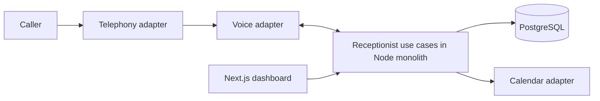

# Architecture proposal

## Repository

One npm package and one Next.js App Router application. Keep use cases in feature modules; route handlers and server actions authenticate, validate, call a use case, and map its result to HTTP. Server components call the same use cases for reads.

```text
src/
  app/                       # Pages, layouts, thin HTTP adapters
    api/health/              # Process liveness only
    dashboard/               # Initial dashboard shell
  modules/
    companies/               # Company configuration and input schemas
    calls/                   # Call lifecycle and caller intake contracts
    appointments/            # Availability and booking contracts
    receptionist/            # Conversation tools and orchestration (next slice)
  providers/
    voice/                   # VoiceProvider port; OpenAI adapter comes later
    telephony/               # TelephonyProvider port; chosen adapter comes later
    calendar/                # CalendarProvider port; Google adapter comes later
  db/
    schema/                  # Drizzle table definitions
    client.ts                # Lazy, server-only PostgreSQL connection
  lib/                       # Shared validation and server environment
drizzle/                     # Reviewed, versioned SQL migrations
docs/                        # Decisions, database proposal, demo acceptance
TODO.md                      # Ordered implementation roadmap
```

Do not add empty service/repository wrappers. Introduce a module's service and repository when implementing its first use case. Modules depend on provider interfaces; only the future composition root selects concrete adapters. Provider SDK types must stay inside adapters. Tenant context is an explicit use-case argument, resolved from authenticated membership or a verified incoming number mapping.

## Runtime and voice

Use PostgreSQL for durable application state. Next.js serves the dashboard and HTTP endpoints. The voice integration needs a persistent connection for events and tool calls. Plan a long-lived Node host for the monolith; before the voice milestone, add a small Node entry point that hosts Next.js and owns call sessions. Do not rely on fire-and-forget work in a route handler or assume a short-lived serverless function can own a call. This entry point is planned, not part of this scaffold.

Evaluate a SIP route to OpenAI first; retain a media-stream bridge as the alternative if the selected carrier requires it. OpenAI documents inbound SIP acceptance and a WebSocket control connection in its [Realtime SIP guide](https://developers.openai.com/api/docs/guides/voice-sip). This supports the runtime choice above; carrier routing, Romanian number availability, transfer behavior, and model selection still need a real call spike. No vendor is chosen by this scaffold.



Adapters normalize incoming events after signature verification over the original request bytes. Map provider account plus called number to a company; never trust a webhook or model-supplied company ID. Store provider event IDs and handle retries/out-of-order lifecycle events. Voice tool arguments pass Zod validation; the server injects company and call IDs and checks allowed actions.

The ports are initial contracts to validate during the carrier spike. For direct SIP, the OpenAI incoming-call webhook and the carrier's call identifier may differ: the composition layer must correlate them using verified routing configuration. Keep transfer orchestration behind `TelephonyProvider`, even if its SIP implementation delegates REFER to the voice transport. A transfer request being accepted does not prove that a human answered. Implement only the chosen transport first; a media-stream bridge will need explicit audio transport capabilities when introduced.

## Scheduling assumptions

The first garage has one appointment calendar with capacity one. Appointments represent vehicle intake slots, not workshop bay or mechanic scheduling. Use a fixed service duration, local business hours in `Europe/Bucharest`, UTC instants in PostgreSQL, and half-open intervals `[start, end)`. Split overnight hours across two days; an absent weekday means closed. Multiple opening windows per day are supported. Date-specific closures are deferred to the MVP configuration milestone.

Availability combines business hours, local pending/confirmed bookings, and Google busy intervals. Serialize local booking attempts per company and recheck availability under the lock. Persist a pending booking with an idempotency key before the external write; reconcile using a stable external event ID. Only confirm verbally after Google confirms. A calendar API write is not a database transaction: timeout/retry recovery must query the existing event before creating another. External manual calendar edits can still race; document that limitation and reconcile conflicts. The scaffold does not implement booking or overlap enforcement yet.

## Tenancy and credentials

Use shared tables with `company_id` on tenant-owned rows and composite foreign keys for tenant-owned references. All repository queries must include tenant scope; composite keys prevent cross-company links but do not authorize reads. Authentication and membership checks are required before exposing real data. The current dashboard contains no tenant data. RLS can be added later if the deployment needs a second isolation layer.

Phone and calendar configurations store credential references only. Start with server environment secrets for the single-company demo; add protected per-company OAuth token storage for the pilot. Never expose provider secrets through `NEXT_PUBLIC_*`, prompts, or logs. Keep caller details on calls and appointments; a separate customer/CRM module is outside scope. Recording audio is outside the initial demo.

## Scaffold boundary

This task adds documentation, a compilable application shell, Zod contracts, provider ports, Drizzle schema and generated SQL. It does not implement auth, tenant queries, provider adapters, webhooks, booking, live transcripts, or a production deployment. Follow `TODO.md` in order.

Framework setup follows the [Next.js installation guide](https://nextjs.org/docs/app/getting-started/installation); database tooling follows the [Drizzle PostgreSQL guide](https://orm.drizzle.team/docs/get-started/postgresql-new).
