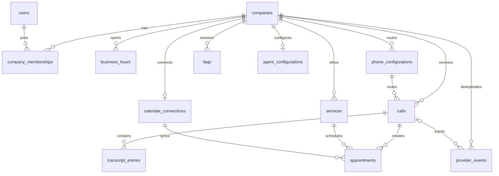

# Initial database proposal

UUID primary keys, `timestamptz` for instants, text plus application validation for E.164 phone numbers, and explicit PostgreSQL enums for small lifecycle states. Company timezone defaults to `Europe/Bucharest`; locale defaults to `ro-RO`. Configuration rows carry timestamps; applications must update `updated_at` on writes.

| Table | Main fields and purpose |
| --- | --- |
| companies | Name, slug, timezone, locale; tenant root |
| users | External auth subject and email; authentication provider selected later |
| company_memberships | Company + user composite key; owner/member role |
| business_hours | Company, ISO weekday 1–7, local opening and closing times; one row per opening window |
| phone_configurations | Company, provider, provider account, unique inbound E.164 number, credential reference, human transfer number, enabled flag |
| services | Company, name, description, appointment duration in minutes, active flag |
| faqs | Company, question, answer, display order, active flag |
| agent_configurations | One per company; greeting, instructions, voice provider/model/voice, language, enabled flag |
| calendar_connections | One per company for MVP; provider, external calendar ID, credential reference |
| calls | Company, phone config, provider/account/call ID, voice session ID, caller number/name, vehicle JSON, issue, status, appointment outcome, summary, start/answer/end instants, duration seconds |
| transcript_entries | Company + call, stable sequence, speaker, text, offset in milliseconds, optional provider item ID; finalized utterances only |
| appointments | Company + call + service + calendar connection, caller/vehicle/issue snapshot, interval, pending/confirmed/failed/cancelled status, request idempotency key, external event ID |
| provider_events | Company, provider/account/event ID, event type, call link, processing status, received/processed instants; minimal deduplication/retry ledger |

Tenant-owned references use `(company_id, id)` composite foreign keys to prevent a transcript, call, or appointment from linking another company's records. Root company references prevent orphan tenant rows. Delete behavior is restrictive until a deliberate retention/deletion workflow exists. Archive configuration using active/enabled flags rather than deleting records referenced by historical calls.

Useful indexes: calls by company/start time; appointments by company/start time; transcript by company/call/sequence. Unique keys deduplicate inbound calls and provider events within provider account, tool booking requests within a company, external calendar events within a connection, and transcript items within a call. Phone numbers are globally unique in this MVP's routing model.

Checks reject negative durations/offsets, invalid weekdays, inverted business-hour/appointment intervals, and invalid call timestamp ordering. Require external event IDs on confirmed appointments. Vehicle JSON stores optional make, model, registration, and year; Zod validates its shape at the application boundary. No separate vehicle/customer tables are needed yet.

The migration does not enforce non-overlapping bookings, authorization, business-hour overlap, IANA timezone validity, or E.164 formatting by itself. The booking transaction and Zod boundaries must enforce these in the next milestones. Calendar busy events are queried externally; they are not copied into a new scheduling subsystem.

`src/db/schema/index.ts` is the executable proposal. `npm run db:generate` creates SQL; inspect it and use `npm run db:migrate` against a configured development database. A migration file being generated does not mean it has been applied.
